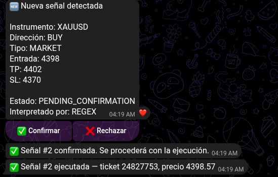

# 🤖 Kronos Bot

**Copia señales de trading de un grupo de Telegram a una cuenta real de MT4, con confirmación humana de por medio — para que operar a las 4 de la mañana sea un tap, no cinco minutos despierto tipeando precios en MetaTrader.**

  

---

## 📖 Índice

- [El problema](#-el-problema)
- [Cómo funciona, en corto](#-cómo-funciona-en-corto)
- [Versiones](#-versiones)
- [Licencia](#-licencia)

---

## 🎯 El problema

Un grupo de señales de trading en Telegram, con buen historial, publica entre la **1:30 a. m. y las 8:00 a. m.** hora del autor. Copiar cada señal a mano significa despertarse, abrir MT4 medio dormido y tipear instrumento, dirección, entrada, take-profit y stop-loss antes de que el precio se mueva — un dígito mal tipeado a esa hora es plata perdida.

Sin presupuesto para un VPS, una API de IA paga, ni un servicio de copy-trading de terceros, Kronos Bot nace como solución propia: correr local, con las piezas justas para resolver el problema real.

La meta de fondo es automatización total — la señal ejecutándose sola mientras el autor duerme. v1 mantiene confirmación humana por diseño: un sistema que mueve dinero real no se suelta a ciegas desde el día uno. Primero se valida cada pieza con un humano en el loop; la decisión se automatiza después.

## ⚙️ Cómo funciona, en corto

Telegram (grupo) → Telethon captura el mensaje → n8n lo parsea e inserta en Postgres → botón de Confirmar/Rechazar por Telegram → al confirmar, un Expert Advisor en MQL4 ejecuta la orden real en MT4 → el resultado (ticket real) vuelve por el mismo camino como confirmación.

Arquitectura, retos técnicos, instalación y configuración están documentados por versión — ver abajo.

## 📦 Versiones

| Versión | Estado | Qué es |
|---|---|---|
| **[v1](docs/versions/v1.md)** | ✅ MVP funcional, ejecución real verificada | Ciclo completo con confirmación humana: captura → parseo por regex → confirmación → ejecución real en MT4 → resultado. Arrancó el 10/08/2026. |
| v2 | ⏸️ En pausa | Automatización completa (sin confirmación manual) + interpretación por Gemini de instrucciones de seguimiento en lenguaje libre. Todavía sin arrancar. |

Cada versión documenta su propia arquitectura, decisiones, retos técnicos, stack, instalación y roadmap — el README no repite ese detalle a propósito, para que quede versionado junto con el código al que corresponde.

Reglas de negocio (fuente única de verdad, no versionadas por release): [`PROTOCOLOS_KRONOS_BOT.md`](PROTOCOLOS_KRONOS_BOT.md). Estado técnico fase por fase: [`STATUS.md`](STATUS.md).

## 📄 Licencia

Uso personal / portafolio. El código es público para que se vea el proceso, pero no está pensado como librería reusable ni producto de terceros. Si algo de acá te sirve como referencia, adelante — mencioná la fuente.

⚠️ *Este proyecto es una herramienta personal de automatización, no un producto de inversión ni una recomendación de trading. Todo el capital operado es propio y el riesgo se gestiona con reglas explícitas y fijas (ver `PROTOCOLOS_KRONOS_BOT.md`).*

---

Construido por [**alejandro-xoxo**](https://github.com/alejandro-xoxo) como proyecto real de aprendizaje, resolviendo un problema propio.

