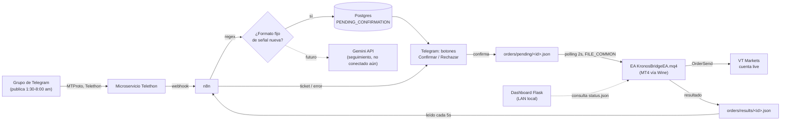
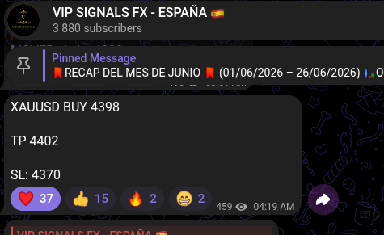
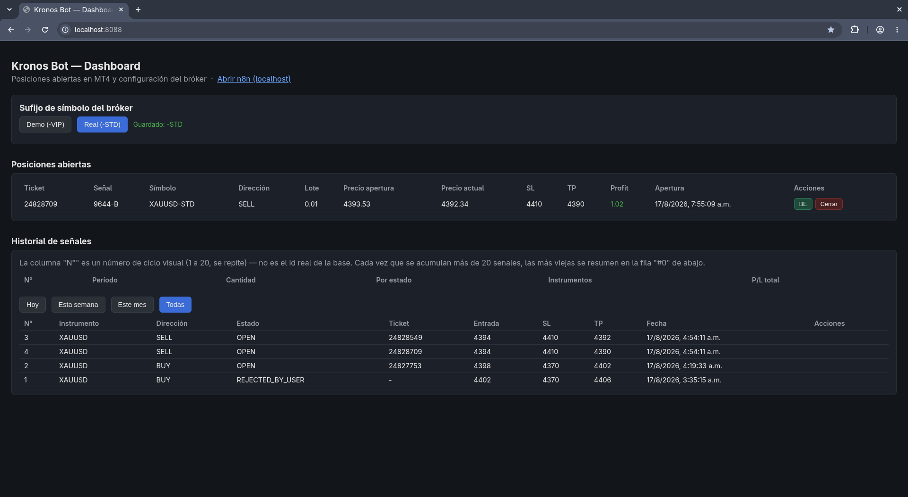
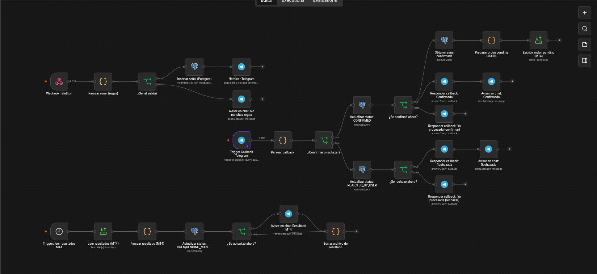
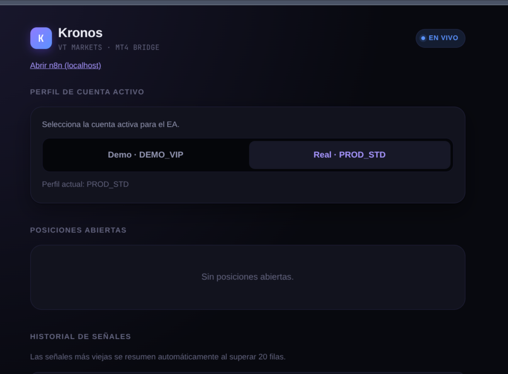

# v1 — MVP funcional

[← Volver al README](../../README.md)

Ciclo completo probado con dinero real: señal del grupo de Telegram → confirmación humana por botón → ejecución real en MT4 → resultado notificado. Arrancado el 10 de agosto de 2026, construido en ~1 semana.

## 📖 Índice de esta versión

- [Historial de versiones](#️-historial-de-versiones)
- [Cómo lo pensé — arquitectura y decisiones](#-cómo-lo-pensé--arquitectura-y-decisiones)
- [Diagrama de flujo](#-diagrama-de-flujo)
- [Retos técnicos](#-retos-técnicos)
- [Stack](#-stack)
- [Instalación](#-instalación)
- [Configuración](#-configuración)
- [Estructura de carpetas](#-estructura-de-carpetas)
- [Evidencia real](#-evidencia-real)
- [Estado de v1](#-estado-de-v1)
- [Hacia dónde escala esto (¿un microservicio?)](#-hacia-dónde-escala-esto-un-microservicio)
- [Aprendizajes](#-aprendizajes)

## 🏷️ Historial de versiones

"v1" no fue un solo salto — se construyó incrementalmente y cada hito real quedó marcado con un tag de Git sobre el commit exacto donde esa capacidad empezó a funcionar (no cualquier commit intermedio):

| Versión | Qué agregó | Fecha |
|---|---|---|
| [`v1.0`](https://github.com/alejandro-xoxo/Kronos_Bot/releases/tag/v1.0) | Señal detectada por regex → confirmación/rechazo por botones de Telegram. Sin ejecución en MT4, sin dashboard. | 2026-08-14 |
| [`v1.1`](https://github.com/alejandro-xoxo/Kronos_Bot/releases/tag/v1.1) | Multi-TP: una señal con varios TP genera sub-señales independientes, cada una con su propia confirmación. | 2026-08-14 |
| [`v1.2`](https://github.com/alejandro-xoxo/Kronos_Bot/releases/tag/v1.2) | **Primera ejecución real de punta a punta en MT4** (EA + escritura de orden + lectura de resultado) — deja de ser solo notificación. | 2026-08-16 |
| [`v1.3`](https://github.com/alejandro-xoxo/Kronos_Bot/releases/tag/v1.3) | Dashboard con control real de posiciones abiertas (botones BE/Cerrar), no solo lectura. | 2026-08-16 |
| [`v1.4`](https://github.com/alejandro-xoxo/Kronos_Bot/releases/tag/v1.4) | Detección automática de cierres por TP/SL. (La Fase 4/Gemini se mergeó en paralelo, pero nunca llegó a activarse en producción — no cuenta como parte funcional de este hito.) | 2026-08-18 |
| [`v1.5`](https://github.com/alejandro-xoxo/Kronos_Bot/releases/tag/v1.5) | Acceso remoto (ngrok + Caddy + login básico) y rediseño premium del dashboard. | 2026-08-21 |
| [`v1.6`](https://github.com/alejandro-xoxo/Kronos_Bot/releases/tag/v1.6) | Migración a workflows aislados (split en 7) — estado actual de producción. | 2026-08-25 |

## 🧠 Arquitectura y decisiones

**Telethon (cuenta de usuario) en vez del Bot API de Telegram.**
El autor no es admin del grupo, y los bots de Telegram solo ven mensajes enviados directo o en grupos donde tienen permisos de miembro. MTProto vía Telethon, autenticado con una cuenta de usuario real, lee el chat igual que lo haría un usuario normal desde su celular.

**n8n como orquestador en vez de un backend propio.**
El cuello de botella del proyecto no es rendimiento, es **iteración de reglas de negocio**: formato de señales, validaciones de antigüedad, reintentos y manejo de callbacks cambiaron varias veces durante el desarrollo. n8n permite ajustar un nodo y reimportar sin tocar infraestructura. Costo aceptado: la lógica de parseo vive en un nodo `Code` (JavaScript) en vez de un módulo Python testeable — trade-off de velocidad de iteración sobre pureza de arquitectura, válido para v1.

**Postgres en vez de Google Sheets como base transaccional.**
Sheets se mantiene como registro legible para humanos, no como fuente de verdad. Confirmar/rechazar una señal necesita una transacción atómica con estado (`PENDING_CONFIRMATION` → `CONFIRMED`/`REJECTED_BY_USER`) resistente a doble clic o webhooks casi simultáneos — trivial con `UPDATE ... WHERE status = 'X' RETURNING`, frágil contra una hoja de cálculo.

**Regex para señales nuevas, Gemini reservado para seguimiento.**
El formato de señal nueva es fijo (`INSTRUMENTO BUY|SELL [LIMIT] PRECIO TP valor SL valor`) — un regex lo resuelve en microsegundos, de forma determinística, sin el costo de latencia de un LLM. Gemini está reservado para la fase de instrucciones de seguimiento en lenguaje libre ("moví el SL a BE", "cerrá a 4374, +20 pips"), donde el formato no es fijo. Diseñado, no implementado todavía (ver [estado](#-estado-de-v1)).

**Confirmación humana obligatoria en v1.**
Decisión de secuencia, no limitación técnica: antes de operar sin supervisión, se valida con un humano en el loop que parseo, lotaje y ejecución en MT4 no fallen. La automatización total es el objetivo declarado de v2, no algo descartado.

**EA propio en MQL4 en vez de un copiador comercial.**
Control total sobre lotaje, manejo de errores específicos del bróker (VT Markets), y la lógica de ejecutar a mercado cuando el precio ya cruzó el nivel de entrada de una LIMIT — nada de esto es configurable en los copiadores genéricos evaluados.

**Todo corre local (CachyOS/Arch + Wine).**
Costo de infraestructura cero mientras se valida rentabilidad en modo semi-automático. Un VPS se justifica después, con historial que lo respalde.

## 🔀 Diagrama de flujo



## 🧩 Retos técnicos

Formato problema → solución, los que más tiempo tomaron resolver:

### Duplicar señales al confirmar dos veces
**Problema:** un doble clic en "Confirmar" (dedo torpe a las 4 a.m., o un reintento de red de Telegram) podía re-ejecutar la orden dos veces.
**Solución:** el `UPDATE` de status usa un CTE con `WHERE status = 'PENDING_CONFIRMATION'` que solo aplica el cambio una vez; el segundo clic actualiza 0 filas, y el callback responde "ya fue procesada" en vez de reinsertar.

### Telethon perdiendo mensajes en el canal de más tráfico
**Problema:** en el grupo real, de tráfico alto, Telethon a veces pedía un resync de "difference" ante un gap de `pts` y **no volvía a disparar `events.NewMessage`** para el mensaje que causó el gap — se perdía en silencio, sin error visible.
**Solución:** agregué un polling de respaldo cada 15s sobre el historial reciente del chat (`iter_messages`), deduplicado por `message_id` contra los ya procesados por el evento en vivo. Red de seguridad, no reemplazo del evento en tiempo real.

### MQL4 no deja escribir archivos fuera de una carpeta sandboxeada
**Problema:** el EA necesita comunicarse con n8n vía archivos, pero `FileOpen`/`FileWrite` en MQL4 están limitados a `MQL4\Files\` del terminal — ni con Wine se puede apuntar a una ruta arbitraria.
**Solución:** la flag `FILE_COMMON` redirige a `.../MetaQuotes/Terminal/Common/Files/`, una carpeta compartida entre todos los terminales del mismo prefijo de Wine, independiente del ID de instalación. `mt4-bridge/orders/` en el repo es un symlink local (no versionado) hacia esa carpeta.

### Docker no puede resolver symlinks que apuntan fuera del árbol montado
**Problema:** n8n corre en un contenedor y necesita leer/escribir en esa misma carpeta de `Common/Files`, pero el symlink del repo apunta a una ruta del host que Docker no puede atravesar.
**Solución:** bind mount directo del destino real (`${MT4_ORDERS_HOST_PATH}` → `/mt4-bridge/orders` dentro del contenedor de n8n), no del symlink — se monta a dónde apunta, no el enlace en sí.

### Condición de carrera al abrir dos órdenes seguidas (mismo instrumento)
**Problema:** cuando una señal trae 2 take-profits, se generan 2 sub-operaciones independientes que el EA manda casi simultáneas — el bróker devolvía error 4109 (trade context busy) en la segunda.
**Solución:** una pausa corta entre `OrderSend` consecutivos en el EA, suficiente para que el contexto de trading del terminal se libere entre una orden y la siguiente.

### `chat_id` reales rompiendo el schema
**Problema:** los IDs de canales/grupos grandes de Telegram son negativos y superan el rango de `INTEGER` en Postgres (`-5523530567`, por ejemplo).
**Solución:** `chat_id`, `message_id` y `reply_to_message_id` son `BIGINT` desde el diseño del schema, no un parche después de que rompiera en producción... aunque de hecho sí rompió una vez antes de que terminara de generalizar el fix a las tres columnas.

### El modo de binarios de n8n cambió sin aviso entre versiones
**Problema:** al leer el archivo de resultado del EA con el nodo `readWriteFile`, el contenido no viajaba en base64 dentro de `item.binary.data.data` como en versiones viejas de n8n — solo había un string literal `"filesystem-v2"`, y decodificarlo como base64 rompía con `SyntaxError`.
**Solución:** leer el buffer real con `await this.helpers.getBinaryDataBuffer(i, 'data')` dentro del nodo `Code`, específico del modo `binaryMode: "separate"` que usa esta versión de n8n.

## 🧰 Stack

| Pieza | Tecnología | Por qué |
|---|---|---|
| Captura de señales | Python + Telethon (MTProto) | Solo una cuenta de usuario puede leer un grupo donde no soy admin |
| Orquestación | n8n (Docker) | Iteración rápida de reglas de negocio, sin costo, corriendo local |
| Base de datos | PostgreSQL | Transacciones idempotentes para el estado de cada señal |
| Ejecución real | MQL4 (Expert Advisor) sobre MT4 vía Wine | Control total del lotaje y manejo de errores del bróker |
| Dashboard | Flask + JS vanilla | Monitoreo simple en la LAN, sin frontend framework innecesario |
| Notificaciones y confirmación | Telegram Bot API | Canal ya presente en el flujo, con soporte nativo de botones inline |
| Interpretación de lenguaje libre (próxima fase) | Gemini API | Reservado para instrucciones de seguimiento sin formato fijo — no conectado aún |

## 🚀 Instalación

**Prerequisitos:**
- Docker y Docker Compose
- Una cuenta de Telegram (no bot) con acceso al grupo a escuchar
- Credenciales de la [API de Telegram](https://my.telegram.org) (`api_id` / `api_hash`)
- Un bot de Telegram para las notificaciones (vía [@BotFather](https://t.me/BotFather))
- MT4 corriendo contra tu bróker (nativo en Windows, vía Wine en Linux — ver guías abajo)
- Un túnel público hacia n8n para que Telegram le llegue (se usó [ngrok](https://ngrok.com/), incluido en el `docker-compose.yml`)

**Guías de instalación por sistema operativo:**

| SO | Guía | Estado |
|---|---|---|
| Linux (escritorio, cualquier distro Arch-based) | [`docs/INSTALL_LINUX.md`](../INSTALL_LINUX.md) | ✅ Verificada end-to-end en la máquina real del autor (CachyOS) |
| Ubuntu Server (headless) | [`docs/INSTALL_UBUNTU_SERVER.md`](../INSTALL_UBUNTU_SERVER.md) | ⚠️ No verificada end-to-end todavía |
| Windows (nativo, sin Wine) | [`docs/INSTALL_WINDOWS.md`](../INSTALL_WINDOWS.md) | ⚠️ No verificada end-to-end todavía |

**Pasos:**

```bash
git clone https://github.com/alejandro-xoxo/Kronos_Bot.git
cd Kronos_Bot

# Completar variables de entorno (ver sección de Configuración)
cp .env.example .env   # crear .env.example si no existe todavía
nano .env

# Levantar todo el stack
docker compose up -d --build

# Setear el bridge con MT4 (symlinks a Common/Files de Wine)
./scripts/setup-mt4.sh        # Linux
# scripts/setup-mt4.ps1       # Windows nativo
```

Después de levantar el stack, hay que importar `n8n-workflows/webhook-mvp-workflow.json` en la instancia de n8n (`localhost:5678`) y activarlo.

> ⚠️ El repo no incluye un `.env.example` todavía — es deuda de documentación pendiente (ver [roadmap](#-estado-de-v1)). Las variables exactas que hacen falta están listadas abajo.

## ⚙️ Configuración

**Variables de entorno (`.env`):**

| Variable | Para qué |
|---|---|
| `TELEGRAM_API_ID` / `TELEGRAM_API_HASH` | Credenciales de la API de Telegram (my.telegram.org) |
| `TELEGRAM_PHONE` | Número de la cuenta que va a leer el grupo (Telethon) |
| `TELEGRAM_GROUP_ID` | ID del grupo a escuchar (se obtiene con `telethon-service/list_groups.py`) |
| `TELEGRAM_USER_CHAT_ID` | Tu chat privado, donde llegan las notificaciones y botones |
| `N8N_HOST` | Dominio público de n8n (para el webhook de Telegram) |
| `N8N_API_KEY` | Para editar el workflow vía API en vez de solo la UI |
| `NGROK_AUTHTOKEN` | Token del túnel público |
| `POSTGRES_USER` / `POSTGRES_PASSWORD` / `POSTGRES_DB` | Credenciales de la base |
| `MT4_ORDERS_HOST_PATH` | Ruta real en el host hacia `.../MetaQuotes/Terminal/Common/Files/orders` (depende de tu prefijo de Wine) |

**Parámetros del EA (`KronosBridgeEA.mq4`, configurables desde MT4 al adjuntarlo a un gráfico):**

| Input | Default | Para qué |
|---|---|---|
| `InpPollIntervalSeconds` | `1` | Cada cuánto revisa `orders/pending/*.json` y `orders/actions/*.json` (BE, cierre) |
| `InpSlippage` | `5` | Slippage máximo en puntos al ejecutar |
| `InpMagicNumber` | `20260814` | Identifica las órdenes abiertas por este EA |
| `InpProfile` | `PROFILE_PROD_STD` | Perfil de cuenta (`PROFILE_PROD_STD` / `PROFILE_DEMO_VIP`) — determina el sufijo real del símbolo en el bróker (`-STD` real / `-VIP` demo en VT Markets) y se valida contra `AccountNumber()`. Actualizable en caliente desde el dashboard vía `orders/config.json`, sin recompilar |

El EA necesita `FILE_COMMON` habilitado y correr con "Permitir importación de DLL" / auto-trading activado en MT4. Instrumentos soportados hoy: **XAUUSD** y **EURUSD**, con el sufijo de símbolo que use tu bróker.

## 📁 Estructura de carpetas

```
Kronos_Bot/
├── telethon-service/     # Microservicio Python — captura de mensajes (Telethon)
├── n8n-workflows/        # Workflow exportado + parser de señales
├── dashboard/            # Dashboard Flask (posiciones, historial, acciones)
├── mt4-bridge/
│   ├── ea/               # Expert Advisor en MQL4
│   ├── orders/           # Symlinks locales a Common/Files (no versionados)
│   └── FORMATO_ARCHIVOS.md
├── db/
│   └── schema.sql        # Schema Postgres, auto-init en el contenedor
├── docs/
│   ├── screenshots/
│   ├── versions/         # Alcance versionado (v1, v2...)
│   └── INSTALL_*.md
├── scripts/               # Setup de MT4/Wine (Linux, Windows, Ubuntu server)
└── docker-compose.yml
```

## ✅ Evidencia real

No es una demo — corrió contra la cuenta real de VT Markets:

```
Señal: XAUUSD BUY 4398.57, TP 4402, SL 4370
→ Confirmada por Telegram
→ Ticket real: 24827753
→ Status: OPEN, visible en el dashboard con precio en vivo
```

<p align="center">
  
  &nbsp;&nbsp;
  
</p>
<p align="center">
  
  <br>
  <sub><i>Señal real del grupo → dashboard con la posición abierta en vivo → el workflow completo en n8n.</i></sub>
</p>

**Rediseño premium del dashboard ([`v1.5`](https://github.com/alejandro-xoxo/Kronos_Bot/releases/tag/v1.5)):** tema oscuro con acento violeta, selector de perfil de cuenta (`DEMO_VIP`/`PROD_STD`), posiciones abiertas con control real (BE/Cerrar) y acceso directo a n8n — reemplazó al dashboard funcional-pero-básico de las capturas de arriba.

<p align="center">
  
</p>

## 📌 Estado de v1

**Hecho ✅**
- [x] Captura en tiempo real (Telethon) + polling de respaldo ante pérdida de eventos
- [x] Parseo por regex de señales de formato fijo, con hasta 2 take-profits por señal (sub-señales independientes, `signal_uid` `-A`/`-B`)
- [x] Validación de antigüedad (descarta señales de más de 5 minutos)
- [x] Confirmación humana idempotente vía botones de Telegram (doble clic no reprocesa)
- [x] Ejecución real en MT4 vía EA en MQL4 (`KronosBridgeEA.mq4`), compilado y corriendo contra la cuenta live de VT Markets
- [x] Cálculo de lotaje dinámico contra el capital real (protocolo sección 5.2: `floor(capital_real / 100) × 0.01`, piso `0.01`), recalculado en cada confirmación — **no** es lotaje fijo
- [x] `capital_real` reportado automáticamente por el EA (`AccountBalance() - AccountCredit()`, excluye crédito del bróker) y actualizado en `settings` sin edición manual
- [x] Lectura de resultados del EA y notificación de vuelta al usuario (ticket real o motivo de fallo)
- [x] Ejecución a mercado si una `LIMIT` ya cruzó el precio de entrada al momento de procesarse, en vez de dejarla como pendiente
- [x] Dashboard local (Flask): posiciones abiertas en vivo, historial con filtros, botones BE / BE inverso / Cerrar / Reintentar, selector de sufijo de símbolo del bróker sin recompilar el EA
- [x] Bridge de archivos n8n ↔ EA vía bind mount de Docker (contenedor no depende de resolver symlinks del host)

**Fuera de v1, a propósito ⏳**
- [ ] Conectar Gemini para interpretar instrucciones de seguimiento en lenguaje libre (mover SL a BE, cierre manual, `CLOSE_AT_PRICE`) — hoy es 100% manual vía dashboard
- [ ] División en slots 80/20 para hasta 2 operaciones simultáneas compitiendo por capital (protocolo sección 5.3) — diseñada, no conectada; hoy cada sub-señal usa el lote total completo sin competencia entre ellas
- [ ] Ciclo de cierre y registro en Google Sheets (Fase 7) — los cierres se hacen manual desde el dashboard y no se registran fuera de Postgres
- [ ] Automatización completa sin confirmación humana — la meta de fondo del proyecto, reservada para v2
- [ ] `.env.example` documentado (hoy hay que inferir las variables del `docker-compose.yml`)
- [ ] Mover la lógica de parseo del nodo `Code` de n8n a un módulo Python testeable, si el proyecto crece más allá de 1-2 brokers/instrumentos
- [ ] Infraestructura en la nube — hoy corre local sin costo, se evalúa un VPS después de validar rentabilidad

## 🌱 Hacia dónde escala esto (¿un microservicio?)

Hoy Kronos Bot es de **uso personal, una sola cuenta**: un Telethon, un n8n, un Postgres, un EA — todo para un solo bróker/cliente. El diseño de referencia para pasar de "uso personal" a "servicio para varios clientes" ya está pensado y documentado en [`ARQUITECTURA_FUTURA.md`](../../ARQUITECTURA_FUTURA.md), aunque **nada de eso está implementado todavía** — es el criterio contra el que evaluar decisiones de hoy, no trabajo en curso.

El modelo no es "un microservicio multi-tenant compartido" — es **multi-instancia aislada**: un único Telethon compartido (la cuenta que sigue el grupo real) hace fan-out del mensaje hacia N instancias independientes, una por cliente, cada una con su propio n8n, Postgres y EA/Wine — sin base de datos ni n8n compartido entre clientes, para que un bug o una fuga de datos de uno nunca afecte a otro.

**Qué falta concretamente para llegar ahí** (todo sin empezar):
- Parametrizar `ENUM_KRONOS_PROFILE` del EA (hoy hardcodeado a 2 valores, `PROD_STD`/`DEMO_VIP`) para que sea configurable por instalación, no un enum fijo compilado.
- Mover la lista de "a qué instancia reenviar cada mensaje" de un archivo de configuración a mano a una tabla de Postgres.
- Flujo de login de bróker por cliente sin centralizar contraseñas (VNC temporal de un solo uso, revocado al terminar).
- Reporte al cliente vía Telegram (solo resumen diario), sin acceso al dashboard técnico — hoy el dashboard es de uso interno sin autenticación pensado para un solo operador.

## 🌱 Hacia dónde escala esto (¿un microservicio?)

Hoy Kronos Bot es de **uso personal, una sola cuenta**: un Telethon, un n8n, un Postgres, un EA — todo para un solo bróker/cliente. El diseño de referencia para pasar de "uso personal" a "servicio para varios clientes" ya está pensado y documentado en [`ARQUITECTURA_FUTURA.md`](../../ARQUITECTURA_FUTURA.md), aunque **nada de eso está implementado todavía** — es el criterio contra el que evaluar decisiones de hoy, no trabajo en curso.

El modelo no es "un microservicio multi-tenant compartido" — es **multi-instancia aislada**: un único Telethon compartido (la cuenta que sigue el grupo real) hace fan-out del mensaje hacia N instancias independientes, una por cliente, cada una con su propio n8n, Postgres y EA/Wine — sin base de datos ni n8n compartido entre clientes, para que un bug o una fuga de datos de uno nunca afecte a otro.

**Qué falta concretamente para llegar ahí** (todo sin empezar):
- Parametrizar `ENUM_KRONOS_PROFILE` del EA (hoy hardcodeado a 2 valores, `PROD_STD`/`DEMO_VIP`) para que sea configurable por instalación, no un enum fijo compilado.
- Mover la lista de "a qué instancia reenviar cada mensaje" de un archivo de configuración a mano a una tabla de Postgres.
- Flujo de login de bróker por cliente sin centralizar contraseñas (VNC temporal de un solo uso, revocado al terminar).
- Reporte al cliente vía Telegram (solo resumen diario), sin acceso al dashboard técnico — hoy el dashboard es de uso interno sin autenticación pensado para un solo operador.

## 💡 Aprendizajes

El reto no fue ninguna tecnología puntual, sino diseñar para fallar bien: qué pasa si Telegram no responde, si el EA no puede escribir un archivo, si dos eventos llegan casi al mismo tiempo. La mayoría de los bugs reales no fueron de sintaxis, sino de estado compartido entre sistemas que no se enteran del estado del otro (n8n no sabe si el EA está vivo, el EA no sabe si n8n ya leyó su resultado). Diseñar con archivos idempotentes y polling, en vez de asumir que "en vivo siempre funciona", fue la lección que más se repitió.

También quedó claro no confiar ciegamente en una librería por buena que sea su documentación: el bug de Telethon perdiendo eventos en canales de alto tráfico no aparece en ningún tutorial — solo se manifestó con tráfico real.
