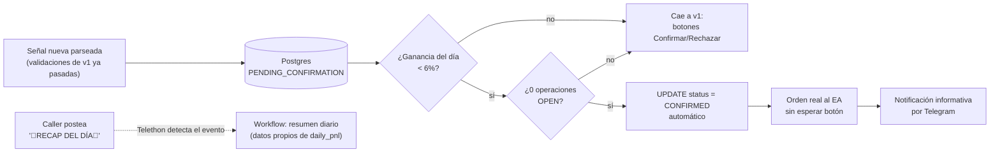
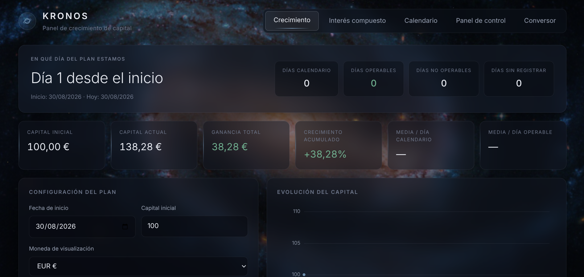
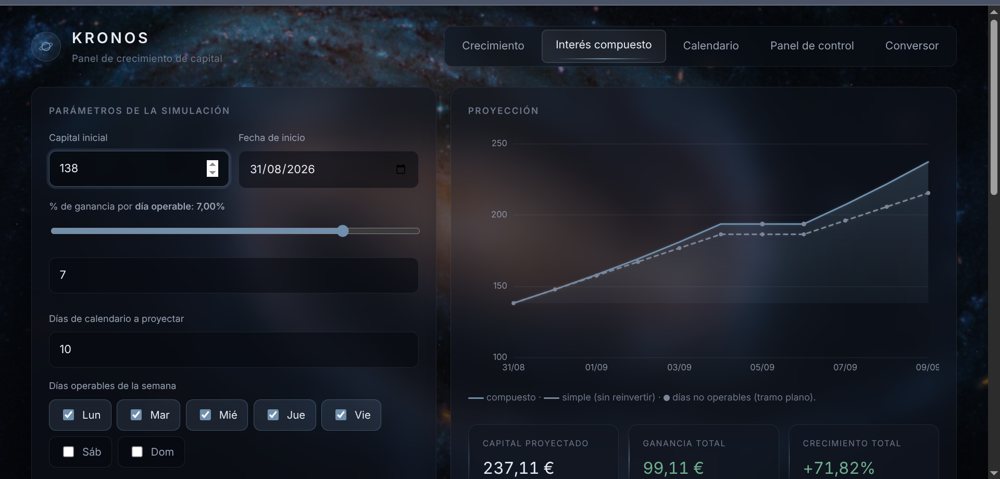
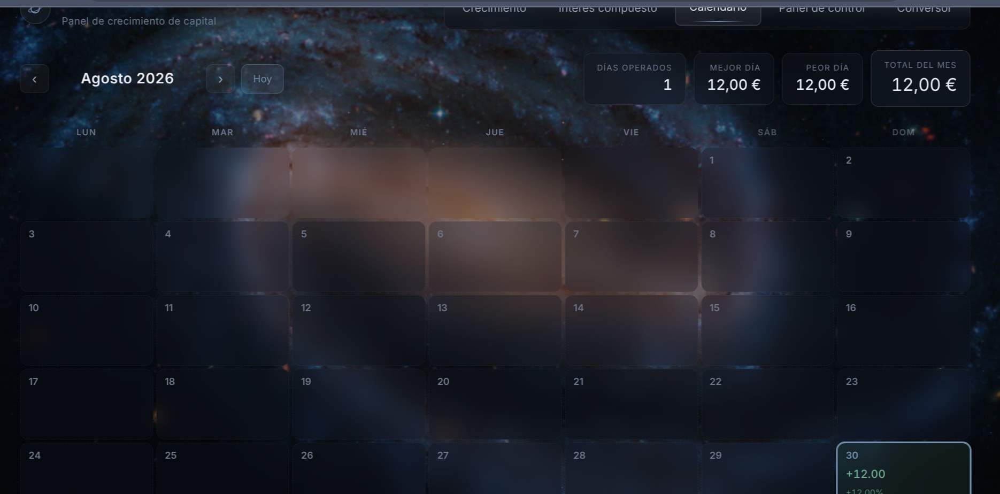
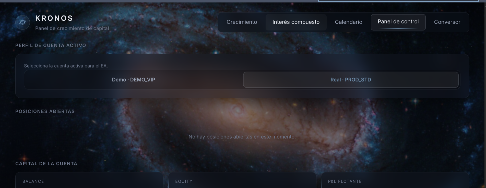
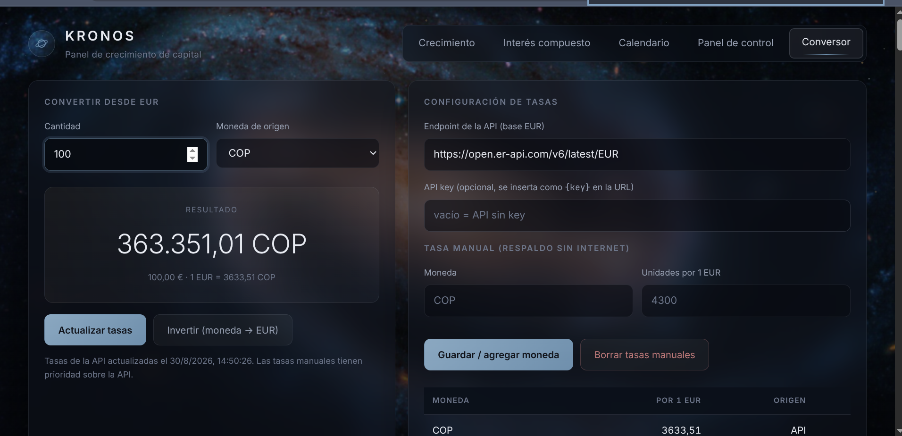

# v2 — Auto-confirmación con control de riesgo

[← Volver al README](../../README.md)

Reemplaza la confirmación humana obligatoria de v1 por controles de riesgo automáticos: tope de una operación simultánea y un circuit breaker de ganancia diaria (editable desde el panel, `v2.5`). En producción real, contra la cuenta live de VT Markets, desde el 30 de agosto de 2026. `v2.6` (2026-09-01) suma una ronda grande de endurecimiento: 8 bugs de producción corregidos y observabilidad nueva (Error Handler, Watchdog por Telegram, backups, healthcheck).

## 📖 Índice de esta versión

- [Historial de versiones](#️-historial-de-versiones)
- [Arquitectura y decisiones](#-arquitectura-y-decisiones)
- [Diagrama de flujo](#-diagrama-de-flujo)
- [Retos técnicos](#-retos-técnicos)
- [v2.6 — Día de endurecimiento](#️-v26--día-de-endurecimiento-2026-09-01)
- [Qué queda igual que v1](#-qué-queda-igual-que-v1)
- [Evidencia real](#-evidencia-real)
- [Estado de v2](#-estado-de-v2)
- [Aprendizajes](#-aprendizajes)

## 🏷️ Historial de versiones

Mismo patrón que v1: cada hito real quedó marcado con un tag de Git sobre el commit exacto donde esa capacidad empezó a funcionar.

| Versión | Qué agregó | Fecha |
|---|---|---|
| [`v2.0`](https://github.com/alejandro-xoxo/Kronos_Bot/releases/tag/v2.0) | Recap diario: tabla `daily_pnl` + trigger `update_daily_pnl` + workflow de mensaje. Fix de contexto perdido en la rama Gemini. | 2026-08-29 |
| [`v2.1`](https://github.com/alejandro-xoxo/Kronos_Bot/releases/tag/v2.1) | `capital_real` reportado por el EA como `AccountBalance()` completo (incluye crédito del bróker) + sync automático cada 5s. | 2026-08-29 |
| [`v2.2`](https://github.com/alejandro-xoxo/Kronos_Bot/releases/tag/v2.2) | Purga simple de `signals` a las 200 filas (sin resumen aparte — `daily_pnl` ya cubre el histórico de P&L). | 2026-08-29 |
| [`v2.3`](https://github.com/alejandro-xoxo/Kronos_Bot/releases/tag/v2.3) | Dashboard reemplazado por PVG_kronos (Crecimiento, Interés compuesto, Calendario, Panel de control, Conversor), integrado como proyecto externo. | 2026-08-29 |
| [`v2.4`](https://github.com/alejandro-xoxo/Kronos_Bot/releases/tag/v2.4) | **Auto-confirmación real**: tope de 1 operación simultánea + circuit breaker de ganancia diaria (6%), fix del error 4109 de raíz, recap disparado por evento en vez de cron, mensajes compactos, dashboard con auto-refresh. | 2026-08-30 |
| `v2.5` | Umbral del circuit breaker configurable desde el panel de control (`settings.circuit_breaker_pct`), en vez de fijo en 6% dentro del workflow. Mergeado y verificado en real. | 2026-09-01 |
| `v2.6` (sin tag todavía) | **Día de endurecimiento**: 8 bugs reales encontrados y corregidos en producción (varios silenciosos, sin síntomas hasta que se investigó por qué una señal/instrucción no se ejecutaba), + observabilidad nueva (Error Handler, Watchdog por Telegram, backup diario de Postgres, script de healthcheck). Ver detalle abajo. | 2026-09-01 |

## 🧠 Arquitectura y decisiones

**Tope de 1 operación simultánea, no slots 80/20.**
El diseño original de v1 repartía el capital en hasta 3 slots para poder tener varias operaciones abiertas a la vez, compitiendo por lotaje. Para auto-confirmar sin supervisión, esa complejidad no vale la pena todavía: con tope de 1 operación `OPEN`, cada señal usa el lote total disponible sin necesidad de repartir nada — no hay "competencia por slot" posible cuando solo puede haber una posición abierta. Ese diseño de slots queda formalmente obsoleto, no borrado: si el tope de 1 se revisa a futuro, es el punto de partida para retomar.

**Circuit breaker por ganancia del día, no por pérdida.**
La automatización total sin red de seguridad era el riesgo real de v1. En vez de confiar en que el parseo y la ejecución nunca fallen, el sistema se autolimita por resultado: si la ganancia acumulada del día llega a ≥6% sobre el capital con el que arrancó ese día, corta la auto-confirmación hasta el día siguiente y cae a confirmación manual (los mismos botones Confirmar/Rechazar de v1). No es un stop-loss de emergencia — es un techo de "ya fue un buen día, lo que sigue se revisa a mano" antes de arriesgar la ganancia ya hecha.

**Fallback a v1, no un modo nuevo.**
Cuando no se cumplen las dos condiciones (0 operaciones `OPEN` y ganancia del día <6%), la señal no se descarta ni se demora — cae exactamente al flujo de v1: notificación con botones y espera de confirmación humana. La auto-confirmación es una capa encima del MVP, no un reemplazo; si algo en el chequeo de riesgo falla o da falso negativo, el peor caso es pedirle al usuario que confirme a mano, nunca ejecutar sin control.

**Recap disparado por el propio caller, no por cron.**
El resumen diario dependía de un Schedule Trigger de n8n, que por defecto corre en la zona horaria `America/New_York` si no se configura explícitamente — con eso el recap llegaba una hora antes de lo esperado según la hora real del autor, un desfase silencioso de timezone. La solución no fue "ajustar el offset a mano" (frágil ante cambios de horario de verano), sino eliminar el cron: Telethon ya está escuchando el grupo real, así que el recap se dispara cuando detecta que el caller posteó su propio "🔖RECAP DEL DÍA🔖" — un evento real del grupo en vez de una hora fija adivinada. El contenido del mensaje que se envía sigue siendo 100% de `daily_pnl` (datos propios calculados por el sistema); no se parsea ni se reutiliza el texto del caller, solo se usa su mensaje como disparador.

## 🔀 Diagrama de flujo

## 🧩 Retos técnicos

### El cron de n8n usa una timezone que no es la tuya
**Problema:** el resumen diario estaba programado con `Schedule Trigger` a las 11:00, pero llegaba consistentemente una hora antes. n8n, sin `GENERIC_TIMEZONE` configurado, cae por defecto a `America/New_York` — no a UTC ni a la zona del servidor.
**Solución:** en vez de calcular y fijar un offset (que se rompe con el cambio de horario de verano), se eliminó el cron por completo. El disparador pasó a ser un evento real: el mensaje de recap que el propio caller ya postea en el grupo, detectado por el mismo Telethon que captura las señales.

### Numerar señales sin usar el `id` de la tabla
**Problema:** el `id` de `signals` es un correlativo total desde que arrancó la base — mostrar "Señal #48" en un mensaje de Telegram no le dice nada al usuario sobre cuántas señales van en el día.
**Solución:** columna `signals.day_number`, poblada por un trigger `BEFORE INSERT` (`set_signal_day_number`) que cuenta cuántas señales entraron ese mismo día calendario y fija el valor una sola vez — no se recalcula si la operación sigue abierta al día siguiente.

### El "una orden por ciclo" no era tan simple como sonaba
**Problema:** el parche original contra el error 4109 (trade context busy) mandaba todas las órdenes pendientes del mismo ciclo de `OnTimer` con un `Sleep(500)` bloqueante entre cada `OrderSend`. Bloquear el hilo del terminal completo con `Sleep()` afecta a todos los símbolos/EAs corriendo en esa instancia de MT4, no solo al ciclo en curso.
**Solución:** procesar como máximo un archivo de `orders/pending/` por llamada a `OnTimer`, dejando que el resto se recoja en los ciclos siguientes — la separación entre `OrderSend` pasa a depender del intervalo real del timer, no de un bloqueo manual.

## 🛠️ v2.6 — Día de endurecimiento (2026-09-01)

Arrancó como una tarea puntual (hacer el circuit breaker editable) y terminó siendo una sesión completa de investigación de producción: el usuario reportó que instrucciones de seguimiento ("mover SL a BE", "cerrar") no se ejecutaban y que una señal nueva no se había notificado. Cada síntoma llevó a un bug real distinto, todos silenciosos — ninguno tiraba una alerta visible hasta que se investigó a mano.

### Bugs corregidos

1. **Nodo inexistente rompía todo el seguimiento por Gemini.** Dos nodos del workflow 07 referenciaban `$('¿Señal válida?')`, un nodo que no existe (el trigger real se llama `Recibido de otro workflow`). Toda instrucción de seguimiento fallaba desde que se activó Fase 4, sin que nadie lo notara.
2. **El aviso de Telegram bloqueaba la ejecución real en MT4 si fallaba.** Un hiccup transitorio de DNS (`getaddrinfo EAI_AGAIN`) en el nodo que notifica "señal auto-confirmada" cortaba el workflow *antes* de escribir la orden para el EA — la señal quedaba `CONFIRMED` en la base pero nunca se ejecutaba. Fix: `onError: continueRegularOutput`, la notificación deja de ser un punto único de falla para la ejecución real.
3. **`$('Nodo').all()` sobre un nodo que puede no haber corrido.** Mismo patrón que el bug 1, en otro lugar: un Code node llamaba `.all()` sobre el nodo de la rama Gemini incluso cuando el mensaje se había clasificado por regex (rama que nunca ejecuta ese nodo). n8n tira `hasn't been executed` en vez de devolver vacío. Fix: `try/catch` alrededor de la llamada.
4. **Modelo de Gemini deprecado.** `gemini-1.5-flash` fue retirado por Google (404). La corrección a `gemini-flash-lite-latest` ya se había aplicado directo a `main` en su momento, pero se perdió en un merge revertido hacia `develop` — y terminó pisada de nuevo al aplicar hotfixes de hoy sobre un archivo desactualizado. Combinado con un regex que no reconocía "CERRAR TODO A BE" (la palabra "TODO" rompía el patrón), una instrucción real de cierre no se pudo interpretar por ninguna vía.
5. **Ejecución triplicada de una misma señal.** Una señal se ejecutó 3 veces en MT4 (3 tickets idénticos, ~1s de diferencia) pese al mecanismo de claim por `FileMove` del EA (que en teoría ya blindaba justo este caso, ver v1). Causa raíz no determinada con certeza desde los logs — se agregó una red de seguridad independiente: `SignalAlreadyExecuted()` chequea si ya existe una orden con el mismo `signal_uid` en el comentario antes de mandar `OrderSend`.
6. **`workflowId` vacío en el botón "Confirmar" manual.** El nodo que dispara la ejecución real tras una confirmación por botón (no automática) nunca tuvo seteado el ID del sub-workflow de ejecución — quedó el placeholder "reseleccionar tras importar" desde el día 0. No hay forma de saber cuántas confirmaciones manuales se vieron afectadas (Fase 2 auto-confirma casi todo, el botón se usa poco). Mismo bug encontrado y corregido después en `split-dev`.
7. **Contraseña de Postgres desincronizada — dos veces.** (a) La contraseña real del rol `kronos` en la base no coincidía con `POSTGRES_PASSWORD` de `.env` — pasó desapercibido porque las conexiones locales usan `trust` en `pg_hba.conf` (sin verificar contraseña), y solo se notó cuando el dashboard (que sí conecta por red) empezó a fallar tras un rebuild. (b) Una credencial de Postgres *guardada dentro de n8n* también tenía una contraseña vieja — "funcionaba" solo porque n8n mantenía una conexión ya autenticada desde antes; recién falló al reiniciar el contenedor. (c) Encontrado el origen probable: `Kronos_Bot-prod` (el checkout del que arranca `start-kronos.sh`) tenía un `.env` desincronizado desde el 30 de agosto respecto al checkout de trabajo.
8. **`Kronos_Bot-prod` desactualizado en general.** El checkout real de producción (`main`, de donde arranca todo al reiniciar la PC) no tenía nada de lo anterior — si se hubiera reiniciado sin sincronizar, varios de estos bugs habrían vuelto solos.

### Endurecimiento agregado

- **Error Handler** (workflow 10): cualquier ejecución fallida de los 9 workflows core ahora manda un aviso por Telegram automático (workflow, nodo, mensaje de error) — antes, un bug como el #1 podía pasar horas sin que nadie se enterara.
- **Watchdog + Backup** (`scripts/watchdog.sh`, `scripts/backup-postgres.sh`): chequeo periódico (pensado para cron) que avisa por Telegram si algo se cae, y dump diario comprimido de Postgres con 30 días de retención — antes no existía ningún backup.
- **`scripts/healthcheck.sh`**: chequeo de conectividad real end-to-end (contenedores, Postgres *por red* — no por `trust` local, que es justo lo que ocultó el bug 7 —, workflows activos, endpoints del dashboard, frescura del EA), 100% de solo lectura, nunca ejecuta nada en MT4 real. Soporta `prod` y `dev`.
- **`retryOnFail`** en todos los nodos de Telegram (3 intentos, 2s de espera) — un DNS hiccup transitorio como el del bug 2 ahora se resuelve solo antes de llegar a cualquier fallback.
- **Cancelación de sub-señales hermanas**: cuando una sub-señal (de una señal con varios TP) llega a `TP_REACHED`, las hermanas que todavía no llegaron a `OPEN` se cancelan automáticamente (nuevo status `CANCELLED_SIBLING_TP`) — evita dejar operaciones pendientes de confirmación esperando un instrumento/entrada/SL cuyo primer TP ya se cumplió.
- **`split-dev` sincronizado**: el mismo ejercicio de comparar archivo-vs-instancia-real se hizo contra el stack dev — la mayoría de sus workflows tenían mejoras en el repo que nunca se habían subido a la instancia (y viceversa, en 2 casos). Ambas bases (`circuit_breaker_pct`, `CANCELLED_SIBLING_TP`) igualadas entre dev y prod.

### Aprendizaje del día

El patrón que más se repitió (bugs 1, 3 y 6) fue una referencia a un nodo/config que nunca existió o dejó de existir, sin ningún error hasta el momento exacto en que ese camino del workflow se ejecutaba — y como Fase 2 auto-confirma casi todo, algunos de estos caminos (confirmación manual, seguimiento por Gemini) casi no se ejercitan en el uso normal. La lección operativa: **comparar el archivo del repo contra lo que realmente corre en la instancia, no asumir que coinciden** — se encontraron divergencias reales en ambas direcciones (repo desactualizado en algunos workflows, instancia desactualizada en otros) en producción, en dev, y en el checkout que arranca todo al reiniciar la PC.

## 🔁 Qué queda igual que v1

Stack, instalación, configuración y estructura de carpetas no cambiaron respecto a [v1](v1.md#-stack) — v2 es una capa de lógica de riesgo sobre el mismo MVP, no una reescritura de infraestructura. Los únicos agregados al schema son las columnas `settings.day_start_capital`/`day_start_date` (base del cálculo de ganancia diaria) y `signals.day_number`.

## ✅ Evidencia real

El circuit breaker y el fix del EA están desplegados y verificados en la cuenta real de VT Markets (proceso corriendo, EA recompilado, workflows activos en la instancia real de n8n). Lo que todavía no ocurrió al momento de escribir esto es una señal real del grupo que dispare la auto-confirmación de punta a punta — la última señal real capturada es anterior a este despliegue. El comportamiento se validó disparando el flujo manualmente contra la base y el bot reales, sin pasar por el grupo de Telegram.

El dashboard es la integración de [PVG_kronos](https://github.com/alejandro-xoxo/PGV_kronos.git), un proyecto externo propio adaptado para consumir los datos reales de Kronos Bot (`daily_pnl`, `capital_real`) en vez de carga manual — no es un reemplazo desde cero, ver `v2.3` en el historial de versiones.

  

  

  

  

  

## 📌 Estado de v2

**Hecho y verificado en real ✅**
- [x] Auto-confirmación de señales nuevas cuando hay 0 operaciones `OPEN` y ganancia del día <6% — ejecución real sin esperar botón, contra la cuenta live
- [x] Circuit breaker de ganancia diaria (≥6%) que corta la auto-confirmación y cae a confirmación manual hasta el día siguiente
- [x] Reset automático del capital de inicio de día (`day_start_capital`/`day_start_date`) sin proceso manual
- [x] Tope de 1 operación simultánea (el diseño de slots de v1 queda obsoleto por esto, no en uso)
- [x] Fix de raíz del error 4109: una orden por ciclo de `OnTimer`, sin `Sleep()` bloqueante
- [x] Recap diario disparado por el mensaje real del caller en el grupo, no por cron con timezone
- [x] Mensajes de Telegram compactos, con emoji según resultado y numerados por `day_number`
- [x] Dashboard con auto-refresh cada 30s

**v2.6 — Hecho y verificado en real ✅**
- [x] Umbral del circuit breaker editable desde el panel de control (`v2.5`) — mergeado a `main` y verificado
- [x] Auto-confirmación disparada por una señal real del grupo (2026-09-01, ticket real ejecutado)
- [x] 8 bugs de producción encontrados y corregidos (ver detalle en la sección v2.6 arriba) — todos verificados con `scripts/healthcheck.sh` tras cada fix
- [x] Error Handler (aviso automático por Telegram ante cualquier ejecución fallida)
- [x] Watchdog + backup diario de Postgres (`scripts/watchdog.sh`, `scripts/backup-postgres.sh`)
- [x] `scripts/healthcheck.sh` — chequeo de conectividad real, de solo lectura
- [x] Red de seguridad anti-duplicado en el EA (`SignalAlreadyExecuted`) — código listo, **pendiente recompilar con MetaEditor**
- [x] `Kronos_Bot-prod` (checkout real de arranque) sincronizado con `main` y con el `.env` de trabajo
- [x] `split-dev` sincronizado con la instancia dev real (misma clase de drift que en producción)

**Pendiente de confirmar en real ⏳**
- [ ] Recompilar el EA con MetaEditor (F7) para que la guarda anti-duplicado tome efecto — el .mq4 ya tiene el fix, el `.ex4` corriendo todavía no
- [ ] Ver la interpretación por Gemini disparada por una instrucción de seguimiento real del grupo, ya con el modelo corregido (`gemini-flash-lite-latest`) — no se confirmó una ejecución exitosa end-to-end contra un mensaje real del grupo después del fix

**Fuera de v2, a propósito ⏳**
- [ ] Volver a slots múltiples (más de 1 operación simultánea) — descartado por ahora a favor de simplicidad y control de riesgo

> El registro legible de cierres (Fase 7 del roadmap original) ya está resuelto — no vía Google Sheets (descartado por completo), sino integrando **PVG_kronos** como dashboard, alimentado por `daily_pnl`.

## 💡 Aprendizajes

Automatizar sin red de seguridad es fácil de programar y difícil de confiar. La parte no obvia de v2 no fue el `IF` que decide auto-confirmar — fue diseñar el circuit breaker como un techo de ganancia, no solo un piso de pérdida, y hacer que cualquier falla de ese chequeo caiga siempre al camino más seguro (confirmación manual), nunca al más automático.

El bug del timezone del cron es un buen recordatorio de que "funciona en mis pruebas" no prueba nada sobre configuración regional: un valor por defecto silencioso (`America/New_York`) puede pasar semanas sin notarse si nadie compara la hora esperada contra la hora real de llegada.
